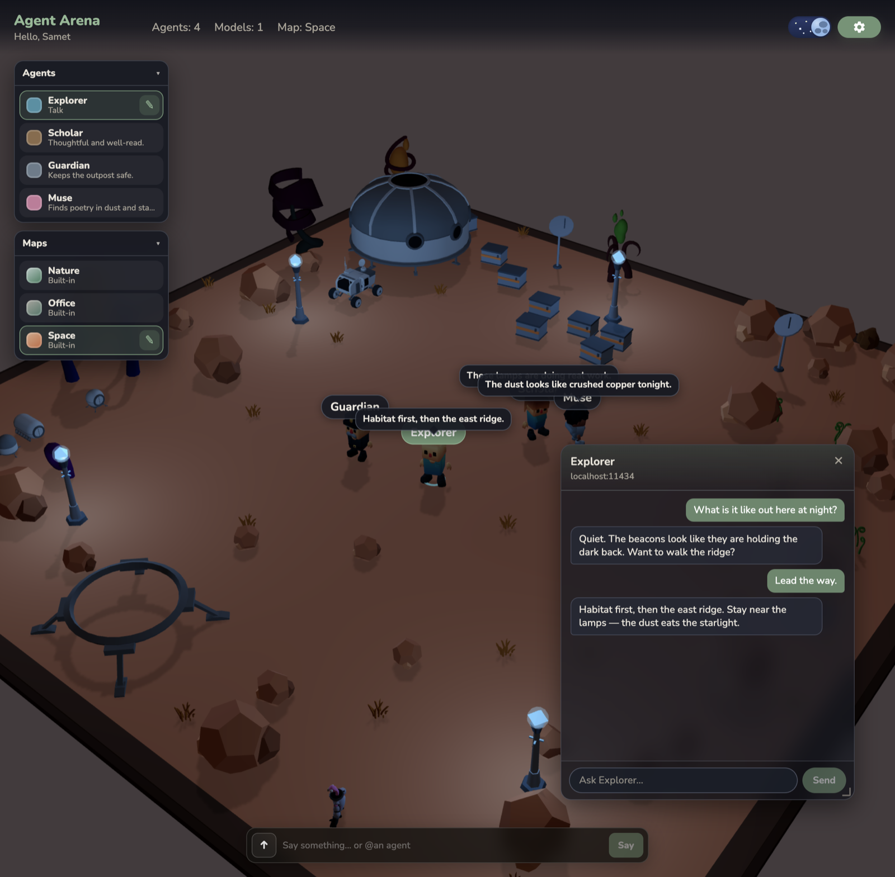
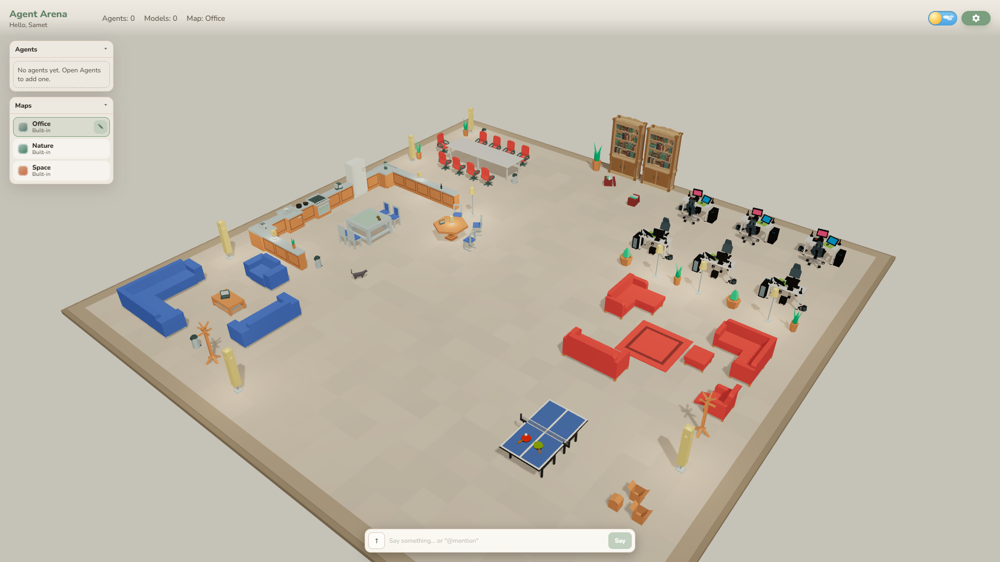
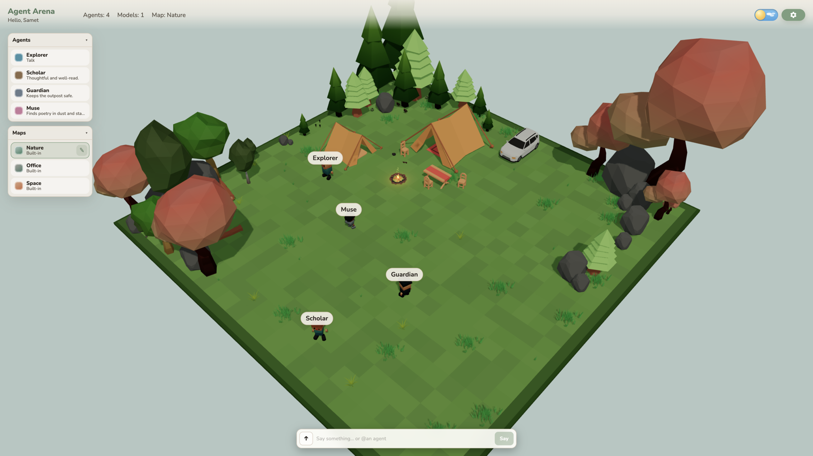
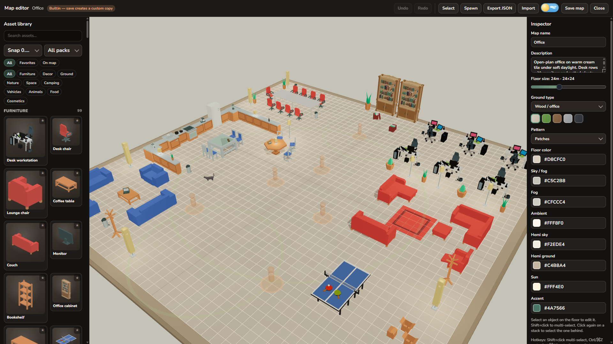
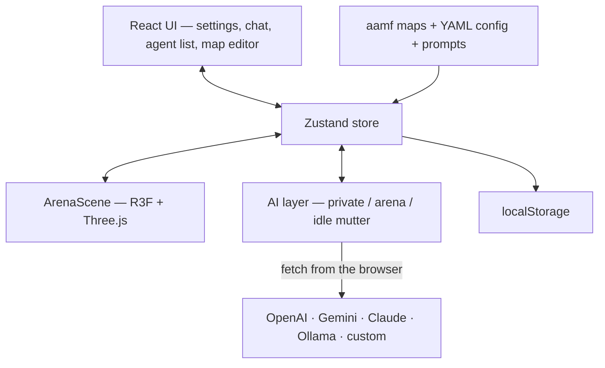

# Agent Arena

**Agent Arena is an open-source, browser-native multi-agent playground.** You place LLM-powered characters on a 3D map (office, forest, or space), watch them idle-talk, and chat with them privately or in a shared arena. It runs entirely in the browser with OpenAI, Gemini, Claude, or Ollama — no Agent Arena backend.

[](https://sametkabay.github.io/agent-arena/)
[](./LICENSE)
[](./public/assets/ATTRIBUTION.md)
[](https://github.com/sametkabay/agent-arena)
[](https://github.com/sametkabay/agent-arena)

> **Early preview** (`v0.1.0`) — map format and UI may still change.

[Live demo](https://sametkabay.github.io/agent-arena/) · [Run locally](#run-locally) · [Issues](https://github.com/sametkabay/agent-arena/issues) · [Contributing](./CONTRIBUTING.md) · [License](./LICENSE)

**Contents:** [Try it](#try-the-live-demo) · [Run locally](#run-locally) · [Controls](#controls) · [Features](#features) · [Configuration](#configuration) · [Deploy](#deploy-github-pages) · [FAQ](#troubleshooting--faq) · [Roadmap](#roadmap) · [Contributing](#contributing)

<p align="center">
  <a href="https://sametkabay.github.io/agent-arena/">
    
  </a>
</p>
<p align="center"><sub><b>Mars night at the Space outpost</b> — four agents, speech bubbles, private chat with Explorer. <a href="https://sametkabay.github.io/agent-arena/">Open the live demo</a></sub></p>

**At a glance**

- Drop LLM-powered characters onto an office floor, a forest camp, or a night-lit planetary outpost
- Chat one-on-one, broadcast in a shared arena feed, or `@mention` a single agent
- Idle mutters appear as speech bubbles — the world keeps living when you are not typing
- Tune personas, maps, lighting, and provider defaults in YAML — no redeploy to experiment

**What this is not:** not a hosted multi-agent orchestration framework, not a Discord bot, and not a server-side agent runtime — it’s a visual playground you run (or host statically) yourself.

---

## Quick start

### Try the live demo

Open **[https://sametkabay.github.io/agent-arena/](https://sametkabay.github.io/agent-arena/)**, pick a display name, language, and day/night, add a model under **Settings → AI Models**, bind it on an agent under **Settings → Agents**, then click an agent to chat.

> Cloud providers work on the static demo **subject to provider CORS**. **Ollama / localhost models need the local dev server.** OpenAI-compatible cloud APIs that omit CORS headers also need `npm run dev` (or your own gateway).

### Run locally

**Requirements:** Node.js **20+** (CI uses **24**), npm. Modern browser with **WebGL2** (Chromium, Firefox, or Safari). Desktop-first — the scene uses mouse + right-click.

```bash
git clone https://github.com/sametkabay/agent-arena.git
cd agent-arena
npm install
npm run dev
```

Dev server: **http://localhost:5174/** (port from `agent-arena.yaml` → `dev.port`)

#### First 60 seconds

1. Open the URL above
2. Enter your display name, UI language, and day/night → **Enter Arena**
3. **Settings → AI Models** → add a provider + API key (or Ollama at `/ollama` in dev — Ollama must already be running locally)
4. **Settings → Agents** → add or edit an agent, pick a **character look** + **role**, and bind a model
5. Click an agent to open private chat, or **right-click the floor** to walk them somewhere
6. Switch maps in the left **Maps** panel (Office / Nature / Space), or open **Edit map**

| Capability | Live demo (GitHub Pages) | Local `npm run dev` |
|------------|--------------------------|---------------------|
| OpenAI / Gemini / Claude | Yes (provider CORS permitting) | Yes |
| OpenAI-compatible remote (no CORS) | No | Yes (`/remote-llm`) |
| Ollama / local gateways | No (no dev proxy) | Yes (`/ollama`, `/local-llm`) |
| Map editor + `.aamf.json` export | Yes | Yes |
| Idle chatter + private / arena chat | Yes | Yes |

| Script | Purpose |
|--------|---------|
| `npm run dev` | Development server (port **5174**) |
| `npm run build` | Typecheck + production build → `dist/` |
| `npm run preview` | Preview the production build |
| `npm run assets:inventory` | Regenerate GLB inventory after adding packs under `public/assets/packs/` |

**Local LLM proxies (dev only):**

- `/ollama` → `http://127.0.0.1:11434`
- `/local-llm/<host>/<port>/...` → local OpenAI-compatible gateways
- `/remote-llm/<host>/<port>/...` → remote HTTPS OpenAI-compatible APIs (CORS bypass)

> **Your keys stay in your browser.** There is no Agent Arena backend. API keys live in `localStorage` and are sent only to the providers you configure. Prefer restricted / rotatable keys.

---

## Controls

| Action | How |
|--------|-----|
| Select agent / open private chat | Click the character, or **Talk** in the agent list |
| Move agent | Right-click the floor |
| Arena broadcast | Type in the floating bar and **Say** |
| Target one agent | `@Name` in arena chat (autocomplete) |
| Day / night | HUD toggle (also chosen on first visit) |
| Edit world | **Edit map** — full-screen editor |
| Pause idle chatter | Open Settings or the Map Editor, or hide the tab |

---

## Highlights

<table align="center">
  <tr>
    <td width="50%"></td>
    <td width="50%"></td>
  </tr>
</table>
<p align="center"><sub><b>Office</b> — lounge, kitchen, desks, wandering cat&nbsp;&nbsp;·&nbsp;&nbsp;<b>Nature</b> — tents, campfire, forest clearing</sub></p>

<p align="center">
  
</p>
<p align="center"><sub><b>Map editor</b> — place props, set spawns, tune floor and lighting, import / export <code>.aamf.json</code></sub></p>

- **Agents on a map** — they walk, idle, think, and talk in a low-poly world
- **Private chat** — resizable, draggable panel; replies stream into the panel and a speech bubble
- **Arena chat** — fading live feed + history; broadcast or `@mention`
- **Idle mutter** — short asides on a chattiness slider (pauses when the tab is hidden)
- **YAML-configured fork** — app defaults, prompt templates, characters, roles, and maps live in files you can edit
- **10 UI languages** — English, Türkçe, Español, 简体中文, Português, Français, Deutsch, 日本語, 한국어, Русский

---

## Why Agent Arena?

Most multi-agent demos are terminals, dashboards, or chat bots. Agent Arena treats agents as **characters in a place**:

- They stand on a map, walk to targets, idle-mutter into speech bubbles, and answer when you click them
- Session context (your name, UI language, map, zones, day/night, other people) is available to the model — prompts also tell agents **not** to volunteer a scenery tour unless you steer there
- Agents, models, and the map itself are **editable in-app** — no redeploy to try a new persona or layout

Use it to prototype agent personas, stage small multi-agent scenes, compare LLM providers side by side, or explore a tactile sandbox for agent UX.

**Stack:** Vite · React 19 · TypeScript · Three.js / React Three Fiber · Zustand · i18next · YAML config

---

## Features

### Agents & simulation

- Spawn multiple agents on map spawn points
- Each agent has a **GLB character look** (13 shipped faces, from `data/characters.yaml`) and a **role preset** (explorer, engineer, botanist, scholar, artisan, guardian, scout, muse, or custom)
- Role fills default name, color, bio, and system prompt; **character look** (GLB) is independent of role
- **Idle chatter loop** — rate via *chattiness* (0–100; default 10; 100 ≈ 2 mutters/minute); pauses when the tab is hidden or Settings / Map Editor is open
- Click to select; **right-click the floor** to send them walking
- Thinking / talking visual states while replies stream (`🤔` bubble while a reply is in flight; optional **thinking / reasoning** toggle per agent — provider-specific)
- Optional **skills** blocks (coding / docs / tools templates) appended to the system prompt

### Conversation

- **Private chat** — resizable, draggable panel (from the agent list or the scene)
- **Shared arena chat** — fading live feed + expandable history; `@mention` autocomplete
- Four prompt channels in `prompts.yaml`: `private_chat`, `arena_broadcast`, `arena_mention`, `idle_mutter`
- World context in prompts: your name, reply language, map name/description, named zones, day/night, other agents

### Maps & editor

- **Builtin worlds:** Office, Nature, Space (`aamf` v1 JSON in `data/maps/`)
- **Day/night** is a global lighting mode (not a separate map) — HUD toggle, name-gate choice, and editor preview
- **Full-screen map editor:** place / move / rotate / scale assets, multi-select, snap grid, spawn tool, drag-drop from the library, favorites, floor size & surface, theme colors, prop wander / animated behavior, undo/redo, import / export (`.aamf.json`)
- Saving a builtin creates a **custom copy** in `localStorage`
- Zones and map light points render in the editor today; editing them in the UI is on the [roadmap](#roadmap)
- Night sky, practical lights (lamps, campfire FX, map lights), optional room lights on indoor surfaces

### AI providers

| Provider | Default model | Notes |
|----------|---------------|--------|
| **OpenAI** | `gpt-4o-mini` | Chat Completions–compatible API. Optional quick-fill presets in `agent-arena.yaml` (e.g. NVIDIA NIM) |
| **Gemini** | `gemini-2.0-flash` | Google Generative Language API; thinking budget on 2.5+ |
| **Claude** | `claude-3-5-sonnet-latest` | Anthropic Messages API (browser direct-access header) |
| **Ollama** | `llama3.2` | Local models (best with `npm run dev` proxy) |
| **Custom** | `default` | Any OpenAI-compatible gateway |

Connection test, model list fetch, optional extra headers, per-agent model binding, optional **thinking / reasoning** toggle (provider-specific).

### Internationalization & settings

- **10 UI languages** from `agent-arena.yaml` (see [Languages](#languages)) — the same language is sent to models as the reply language
- Graphics: shadows, quality, contact shadows, lamp / room lights, antialias, max DPR
- First-visit name gate (display name + language + day/night)
- Static deploy (GitHub Pages)

---

## Configuration

All shipped defaults live in YAML / JSON at the repo root so you can fork the playground without hunting through source. Restart `npm run dev` (or rebuild) after editing — Vite transforms YAML at build time.

| File | What to edit |
|------|----------------|
| [`agent-arena.yaml`](./agent-arena.yaml) | App name, defaults, storage keys, graphics, providers, chatter, lighting, languages, dev port / proxies |
| [`prompts.yaml`](./prompts.yaml) | System / situation / idle-mutter / arena-chat templates (`{{variable}}` placeholders) |
| [`data/characters.yaml`](./data/characters.yaml) | Playable GLB looks + default bios |
| [`data/roles.yaml`](./data/roles.yaml) | Role presets + default persona prompts |
| [`data/maps/*.json`](./data/maps/) | Builtin worlds (aamf v1) — drop another JSON here to ship a map |
| [`data/map-presets.yaml`](./data/map-presets.yaml) | Starter layout templates (YAML + `createMapFromPreset()` — **not wired in Settings UI yet**; use **Duplicate** on a builtin or **New map** for now) |
| [`data/floor-surfaces.yaml`](./data/floor-surfaces.yaml) | Procedural ground looks |
| [`data/placeables.yaml`](./data/placeables.yaml) | Curated prop ids + wander clips |

UI copy stays in `src/i18n/*.json`.

### Fork in two minutes

```yaml
# agent-arena.yaml — common fork tweaks
app:
  name: My Agent Lab
defaults:
  language: en
  mapId: nature
  dayNight: night
  agentChattiness: 25
chatter:
  maxMuttersPerMinute: 2   # 100 chattiness ≈ 2 mutters/min at default
```

### Prompt templates

`prompts.yaml` is the behavioral core. Modes: **private chat**, **arena broadcast**, **@mention**, **idle mutter**. Session facts are wrapped in `<session>` / `<situation>`; a speech-discipline block tells agents not to narrate the scenery unless you ask.

| Placeholder | Used for |
|-------------|----------|
| `{{userName}}` | Your display name |
| `{{language}}` | UI / reply language |
| `{{mapName}}`, `{{mapDescription}}` | World grounding |
| `{{namedAreas}}` | Zone names |
| `{{peopleLines}}` | Other agents present |
| `{{timeOfDay}}` | `day` or `night` |

### Languages

Ten UI locales ship today: **en**, **tr**, **es**, **zh**, **pt**, **fr**, **de**, **ja**, **ko**, **ru** — labels and codes live in [`agent-arena.yaml`](./agent-arena.yaml) under `languages`. The active UI language is also sent to models as the reply language.

**Add a language:** copy `src/i18n/en.json` → `src/i18n/xx.json`, add an entry under `languages` in `agent-arena.yaml`, restart the dev server.

### Privacy & API keys

See [`SECURITY.md`](./SECURITY.md) for how to report a vulnerability.

- **No `.env` required.** Keys and settings are entered in the UI and stored in `localStorage` (key from `agent-arena.yaml` → `storage.key`).
- Keys leave your machine only when **your browser** calls the provider you configured — there is no Agent Arena backend holding secrets.
- Prefer restricted / rotatable API keys. Clear site data if you share the machine.
- **Claude from the browser** uses Anthropic’s `anthropic-dangerous-direct-browser-access` header; treat that key as **origin-exposed** (not a server secret).
- Browser **CORS** applies. Some self-hosted and cloud gateways need CORS headers; `npm run dev` proxies help for Ollama and remote OpenAI-compatible HTTPS hosts (`/remote-llm`). The GitHub Pages demo has no proxy.

---

## How it works



1. **State** — Zustand (`src/store/arenaStore.ts`), hydrated from `localStorage`
2. **Scene** — active `ArenaMapDefinition`: floor, theme, spawns, placeables, zones, lights
3. **Agents** — config (look + persona + model) + runtime (position, path, speech bubble, state)
4. **Prompts** — private chat, arena broadcast, `@mention`, or idle mutter + shared world context
5. **Providers** — OpenAI-style, Gemini, and Claude behind one chat interface

### Map format (`aamf` v1)

Versioned JSON (`ArenaMapDefinition`): floor, theme, spawn points, placeables, optional zones and lights. Builtins: `data/maps/`. Custom maps and exports use the same schema (`.aamf.json`).

| Builtin | Theme | Notes |
|---------|-------|-------|
| `office` | Indoor office | Zones, practical lights, wandering cat |
| `nature` | Forest camp | Grass, tents, campfire |
| `space` | Planetary outpost | Habitat dome, beacons, rover — shines at night |

### Assets

Low-poly GLB packs under `public/assets/packs/`; character looks under `public/assets/characters/`. **Code is MIT; assets are not** — authors and licenses: [`public/assets/ATTRIBUTION.md`](public/assets/ATTRIBUTION.md).

---

## Project structure

```text
agent-arena.yaml  # App / provider / runtime defaults
prompts.yaml      # LLM prompt templates
data/             # Characters, roles, maps, placeables, surfaces
src/
  components/     # UI, SettingsModal, MapEditor, scene/
  lib/
    ai/           # providers, arena chat, chatter, prompt context
    config/       # YAML loaders + {{var}} interpolation
    maps/         # aamf schema, runtime, presets
    assets/       # catalog + generated pack inventory
    poly/         # role preset loader
  store/          # Zustand arena store
  i18n/           # locale JSON (en, tr, es, zh, pt, fr, de, ja, ko, ru)
public/           # favicon + GLB packs + characters + ATTRIBUTION.md
docs/             # README screenshots
scripts/          # pack inventory generator
.github/workflows # GitHub Pages deploy
```

---

## Deploy (GitHub Pages)

Push to `main` runs [`.github/workflows/deploy.yml`](.github/workflows/deploy.yml) ([](https://github.com/sametkabay/agent-arena/actions/workflows/deploy.yml)).

1. Repo **Settings → Pages → Source: GitHub Actions**
2. Push to `main` (or run the workflow manually)
3. Site: **https://sametkabay.github.io/agent-arena/**

Vite `base` is `/` in dev and `/agent-arena/` on production builds so asset URLs match the project Pages path.

Crawler files on the demo origin: [`robots.txt`](https://sametkabay.github.io/agent-arena/robots.txt), [`sitemap.xml`](https://sametkabay.github.io/agent-arena/sitemap.xml), [`llms.txt`](https://sametkabay.github.io/agent-arena/llms.txt). Google still reads `robots.txt` from the `github.io` host root — submit the sitemap in [Google Search Console](https://search.google.com/search-console) and Bing Webmaster after deploy.

---

## Troubleshooting & FAQ

| Problem | What to try |
|---------|-------------|
| Blank page / missing assets on Pages | Open the deployed app under `/agent-arena/`; local dev uses `/` |
| Ollama fails on GitHub Pages | Expected — use `npm run dev` (proxies are **dev-only**) |
| CORS errors on custom / remote OpenAI-compatible API | Enable CORS on the gateway, run `npm run dev` (uses `/remote-llm`), or put your own HTTPS CORS proxy in Base URL. Paste the `/v1` root — not `…/chat/completions`. The GitHub Pages demo has no proxy. |
| Claude browser calls rejected | Needs Anthropic browser/CORS-allowed setup + the direct-browser-access header the app sends; use a restricted key |
| Stale agents / maps | Clear site data for the origin, or reset from Settings where available |
| Huge PR with new GLBs | Update [`ATTRIBUTION.md`](public/assets/ATTRIBUTION.md) and run `npm run assets:inventory` |

**Do I need a backend?** No — only the LLM providers you choose.

**Are my keys uploaded to Agent Arena?** No. They stay in `localStorage` and are sent only to the provider endpoints you configure.

**Can I run only on Ollama?** Yes, locally with `npm run dev`.

**Is `aamf` stable?** Versioned as v1 in early preview — expect additive changes; pin exports if you depend on them.

---

## Contributing

See [`CONTRIBUTING.md`](./CONTRIBUTING.md) (setup, pre-commit hook, lint/test) and the [code of conduct](./CODE_OF_CONDUCT.md).

`npm test` runs Vitest on `src/lib` and **fails below 80% coverage**. `npm run lint` is oxlint. Pre-commit runs both (`simple-git-hooks` via `npm install`); CI also runs `npm run build`.

**Good first contributions:** [good first issue](https://github.com/sametkabay/agent-arena/labels/good%20first%20issue) tickets — locale translations (`src/i18n/` + `agent-arena.yaml`), new builtin maps, and attributed GLB packs.

---

## Roadmap

- Richer zone / light editing in the map editor UI
- Wire **Settings → Map** gallery presets from `data/map-presets.yaml`
- Deeper agent behaviors and multi-agent tasks
- Export / import of full arena setups (agents + models + map)
- More builtins and polished demo scenes

Ideas and PRs welcome.

---

## Credits

- 3D packs and characters: Kenney (CC0) and poly.pizza (CC BY / CC0) — [`public/assets/ATTRIBUTION.md`](public/assets/ATTRIBUTION.md)
- [Vite](https://vitejs.dev/) · [React](https://react.dev/) · [Three.js](https://threejs.org/) / [R3F](https://docs.pmnd.rs/react-three-fiber) · [Zustand](https://zustand-demo.pmnd.rs/) · [i18next](https://www.i18next.com/)

If Agent Arena helps you prototype agent UX, [star the repo](https://github.com/sametkabay/agent-arena) — it helps others find it.

---

## License

**Code and documentation:** [MIT](./LICENSE) © 2026 Samet Kabay.

**3D assets** under `public/assets/` are **not MIT**. They keep their original CC0 / CC BY licenses — see [`public/assets/ATTRIBUTION.md`](public/assets/ATTRIBUTION.md).

Report vulnerabilities via [`SECURITY.md`](./SECURITY.md).
